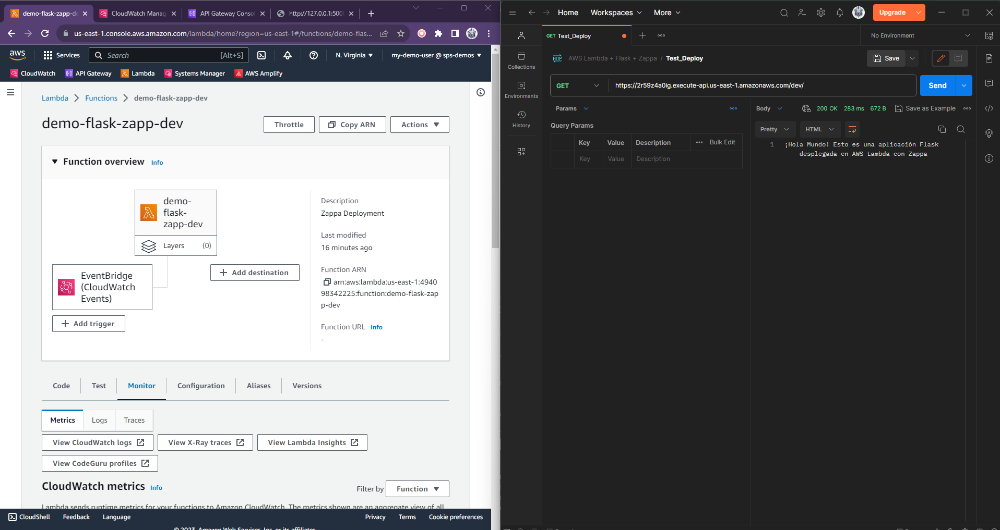
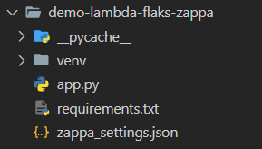

# Desplegar aplicación Flask como una función de AWS Lambda con Zappa
En este repositorio, te guiaré paso a paso a través del proceso de despliegue de una aplicación Flask en AWS Lambda utilizando Zappa, una herramienta que simplifica la integración de aplicaciones.

## 💻 Requerimientos
- Phyton (por el momento Zappa solamente acepta versiones 3.6 a 3.10)
- Credenciales AWS (con permisos para s3 y lambda)

## 📝 Paso a paso

### Paso 1: Configurar el entorno virtual.

1.1 Crear entorno virtual:

```
py -m venv venv
```

1.2 Activar entorno virtual (Windows):

```
venv\Scripts\activate
```

*Nota*: cuando termines basta con ejecutar el comando `deactivate` para desactivar el entorno virtual.

### Paso 2. Instalar Flask y Zappa.

Dentro de tu entorno virtual, instala Flask y Zappa usando pip:

```python
# Instalación de flask y zappa
pip install flask zappa
```

### Paso 3. Crear tu aplicación Flask.

En este ejemplo vamos a definir nuestro archivo app.py como nuestra aplicación Flask de la siguiente manera:

```python
from flask import Flask

app = Flask(__name__)

@app.route('/')
def hello_world():
    return '¡Hola Mundo!'
```
Para probarla localmente puedes usar el siguiente comando:

```python
# Levantar flask localmente para pruebas
flask run
```

### Paso 4: Inicializar Zappa.

Con nuestra aplicación Flask lista, inicializamos Zappa dentro del directorio de proyecto:

```python
# Inicializar Zappa
zappa init
```

Se generará un archivo *zappa_settings.json* en la raíz del proyecto.

### Paso 5: Despliegue de la aplicación Flask en AWS Lambda.

Es hora de desplegar nuestra aplicación en AWS Lambda con el siguiente comando:

```python
# Sentencia global
zappa deploy {ambiente}

# Sentencia para desplegar todo lo que tengamos como proyecto y ambientes
zappa deploy --all

# Nuestra sentencia para probar
zappa deploy dev
```

Zappa se encargará de empacar la aplicación, crear los recursos necesarios en AWS y proporcionar una URL para acceder a nuestra aplicación.

Con la URL proporcionada podemos acceder a nuestra aplicación, en este caso usaremos Postman para validar el mensaje de respuesta:



### Pasos opcionales.

#### Actualizar aplicación

Si realizas cambios en tu aplicación Flask y deseas actualizar la función Lambda, simplemente ejecuta el siguiente comando:

```python
# Actualizar aplicación
zappa update {env}

# Si en la actualización se ocupa una dependencia, generar requeriments.txt
pip freeze > requirements.txt
```

#### Eliminar aplicación

Se utiliza para eliminar la función AWS Lambda y los recursos relacionados que se crearon durante el proceso de despliegue de la aplicación.

```python
# Borrar despliegue de la aplicación
zappa undeploy {env}
```

## 📂 Estructura de la carpeta




## 📚 Documentación

Artículo completo en [Medium](https://medium.com/@brendagalicia/c%C3%B3mo-desplegar-aplicaciones-flask-como-aws-lambda-con-zappa-445f1a2dbd15 "Ver detalles.").

## 🎬 Demo

Video completo de la demo en [YouTube](https://youtu.be/d-2RiELu-Vs "Ver detalles.").
